# ContractSwarm

**AI agents swarm your contracts so you don't have to.**

ContractSwarm is an AI-powered compliance tool that helps in-house lawyers assess whether they can legally onboard a new third-party vendor that will process their clients' data. It deploys a swarm of Claude AI agents to analyze every client contract in parallel — surfacing risks, violations, and draft amendments in minutes instead of weeks.

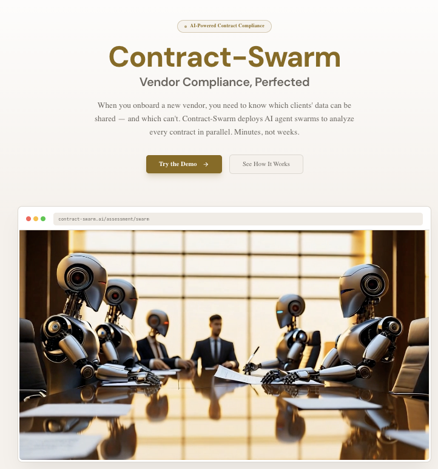

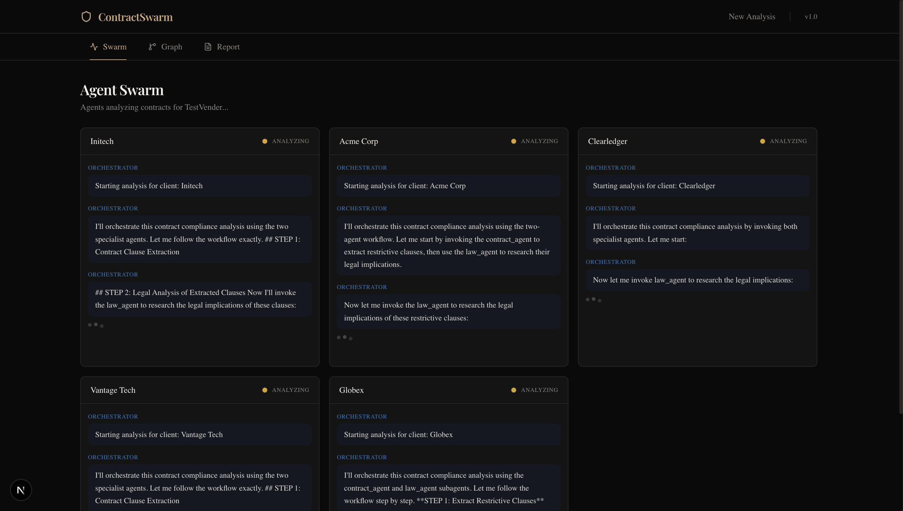

---

## How It Works

1. **Upload contracts** — Point to a directory of client contract PDFs
2. **Describe the vendor** — What does the vendor do? What data will it access? Where does it operate?
3. **Launch the swarm** — One agent team per contract, all analyzing in parallel
4. **Get results** — Per-client risk scores, violation reports, and ready-to-review contract amendments

---

## Architecture Overview

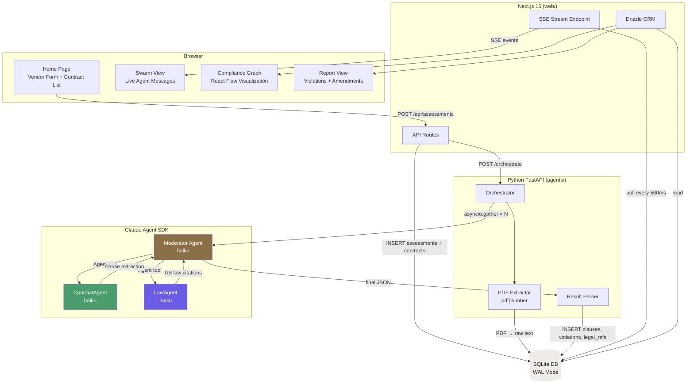

---

## Data Flow

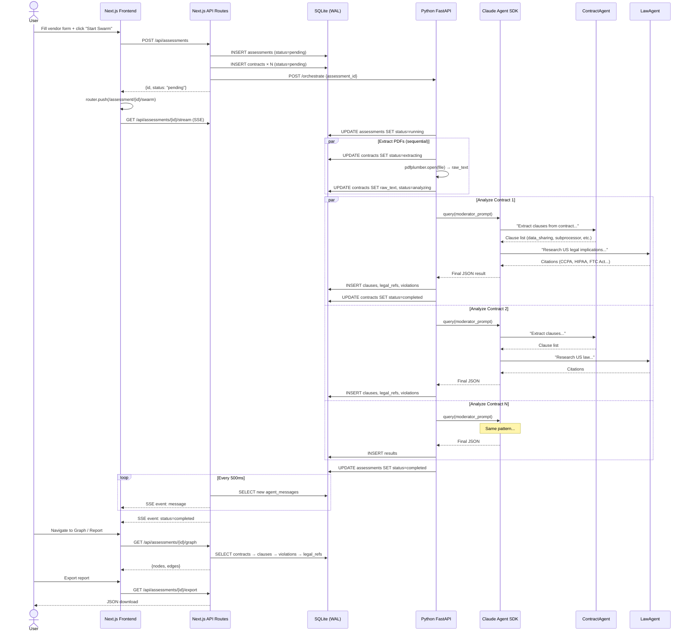

---

## Agent Swarm Architecture

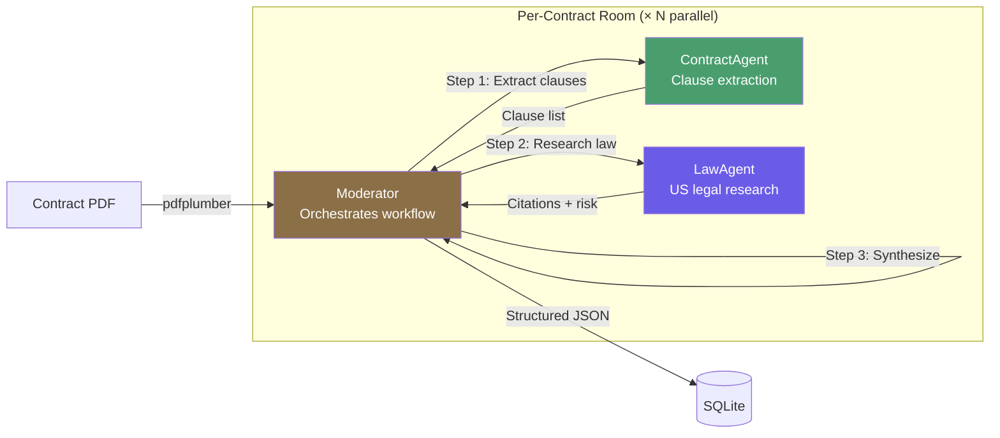

Each contract gets its own independent agent team. All teams run in parallel via `asyncio.gather()`. The Moderator invokes ContractAgent and LawAgent as subagents using Claude Agent SDK's `Agent` tool. All agents run on `claude-haiku-4-5`.

**ContractAgent** identifies restrictive clauses:
- Data sharing / subprocessor restrictions
- Consent requirements
- Data residency constraints
- Exclusivity / non-compete
- Confidentiality / liability / IP rights

**LawAgent** researches US law implications:
- CCPA/CPRA (Cal. Civ. Code §1798.100–§1798.199.100)
- HIPAA (45 C.F.R. Parts 160 and 164)
- Case law precedents via Midpage API
- No other laws are cited (GDPR, FTC Act, state privacy acts, UCC are explicitly excluded)

---

## Thenvoi Integration

ContractSwarm is built on [Thenvoi](https://app.thenvoi.com), a multi-agent communication platform that provides the real-time messaging infrastructure for agent coordination. Each contract analysis maps to a **Thenvoi chatroom** — agents connect via WebSocket, exchange findings through structured messages, and produce results visible to both humans and other agents in the same room.

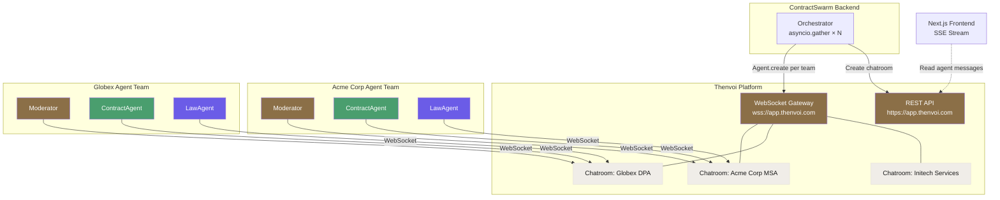

### Chatroom-per-Contract Pattern

Every contract analysis gets its own dedicated Thenvoi chatroom. The `agent_rooms` table stores the mapping via `thenvoi_chat_id`:

| Contract | Thenvoi Chatroom | Agents |
|----------|-----------------|--------|
| Acme Corp MSA | `chatroom-abc123` | Moderator, ContractAgent, LawAgent |
| Globex DPA | `chatroom-def456` | Moderator, ContractAgent, LawAgent |
| Initech Services | `chatroom-ghi789` | Moderator, ContractAgent, LawAgent |

This pattern means every agent conversation is **observable** — humans can join any chatroom on the Thenvoi platform to watch the analysis unfold in real-time, or review the full transcript after completion. Every message exchanged between agents is persisted to the `agent_messages` table and streamed to the frontend via SSE.

### SDK Usage

Agents connect to Thenvoi using `thenvoi-sdk[claude_sdk]`, which wraps Claude Agent SDK behind Thenvoi's adapter layer:

```python
from thenvoi import Agent
from thenvoi.adapters import ClaudeSDKAdapter
from thenvoi.core.types import AdapterFeatures, Emit

# Wrap Claude Agent SDK with Thenvoi's communication adapter
adapter = ClaudeSDKAdapter(
    model="claude-haiku-4-5-20251001",
    custom_section=agent_prompt,
    features=AdapterFeatures(emit={Emit.EXECUTION}),
)

# Create an agent connected to the Thenvoi platform
agent = Agent.create(
    adapter=adapter,
    agent_id=agent_id,        # Registered at app.thenvoi.com
    api_key=api_key,           # Per-agent API key
    ws_url="wss://app.thenvoi.com/api/v1/socket/websocket",
    rest_url="https://app.thenvoi.com",
)

# Agents run concurrently — each connected via its own WebSocket
await asyncio.gather(moderator.run(), contract_agent.run(), law_agent.run())
```

The `ClaudeSDKAdapter` bridges Claude Agent SDK's `query()` interface with Thenvoi's WebSocket messaging — agents reason with Claude while communicating through Thenvoi chatrooms. The `AdapterFeatures(emit={Emit.EXECUTION})` flag streams execution-level events (tool calls, subagent invocations) into the chatroom, making the full reasoning chain visible to observers.

### Dual Mode Operation

ContractSwarm supports two execution modes, ensuring the system works with or without a Thenvoi account:

| Mode | `thenvoi_chat_id` | Communication | Use Case |
|------|-------------------|---------------|----------|
| **Thenvoi Platform** | `chatroom-{uuid}` | Real WebSocket chatrooms | Production — full observability, human-in-the-loop |
| **Direct** | `"direct-mode"` | Claude Agent SDK `query()` + subagents | Development — no Thenvoi account needed |

Set `THENVOI_WS_URL` and `THENVOI_REST_URL` in your environment to enable platform mode. Without them, the system falls back to direct mode using Claude Agent SDK's native subagent pattern — same analysis, same results, but without the real-time chatroom observability that Thenvoi provides.

---

## Multi-Agent Orchestration

The swarm pattern runs N independent agent teams in true parallel — one team per contract, all executing concurrently via `asyncio.gather()`. Each team follows an identical 3-step workflow orchestrated by a Moderator agent.

### Parallel Execution Model

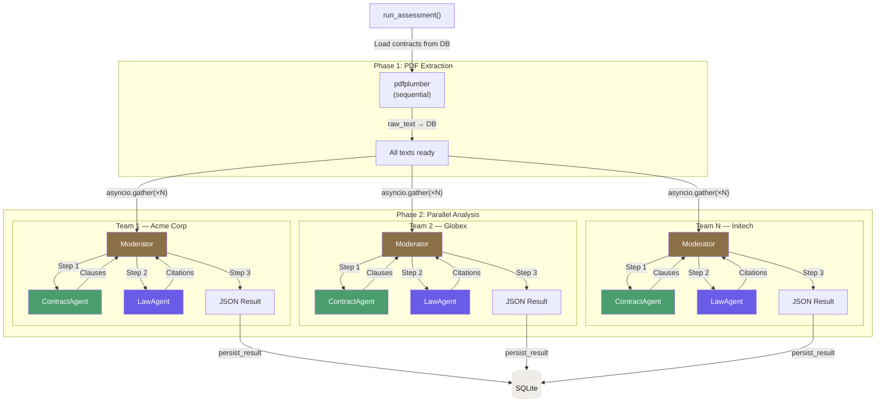

### 3-Agent Hierarchy

Each contract team is a self-contained unit with a strict hierarchy:

| Agent | Role | Model | Tools | Responsibilities |
|-------|------|-------|-------|-----------------|
| **Moderator** | Orchestrator | `claude-haiku-4-5` | `Agent` (invoke subagents) | Coordinates 3-step workflow, synthesizes final JSON result |
| **ContractAgent** | Specialist | `claude-haiku-4-5` | None (pure reasoning) | Clause extraction, risk rating, contract value identification |
| **LawAgent** | Specialist | `claude-haiku-4-5` | None (pure reasoning) | US legal research — CCPA + HIPAA only, case citations |

The Moderator is the only agent with tool access — it uses Claude Agent SDK's `Agent` tool to invoke the two specialists as subagents. Specialists have `tools=[]` (no file, shell, or MCP access), operating as pure reasoning agents that respond to the Moderator's prompts.

### Per-Contract Workflow

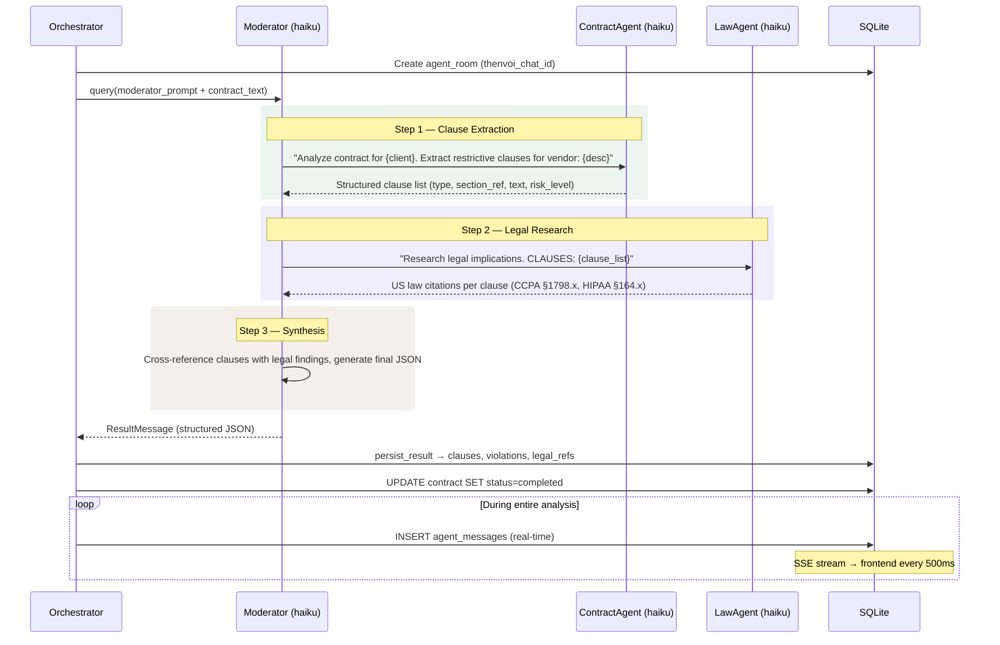

### Claude Agent SDK Integration

The orchestrator uses Claude Agent SDK's core primitives to wire up the multi-agent system:

- **`ClaudeAgentOptions`** — configures the Moderator with `model="haiku"`, `allowed_tools=["Agent"]`, and `permission_mode="bypassPermissions"`
- **`AgentDefinition`** — defines each subagent with a `description` (used by the Agent tool for routing), a `prompt` (system instructions), and `model="haiku"`
- **`query()`** — async generator that streams `AssistantMessage` and `ResultMessage` events; each `TextBlock` is saved to `agent_messages` for the frontend SSE stream
- **`agents={}`** — the named subagent registry passed to the Moderator, enabling `Agent` tool invocations by name (`"contract_agent"`, `"law_agent"`)

Contract text is truncated to 6,000 characters and embedded only in the Moderator's prompt — subagent definitions stay lightweight. The Moderator passes relevant context when invoking each specialist, keeping token usage efficient across the 3-agent chain.

---

## Database Schema

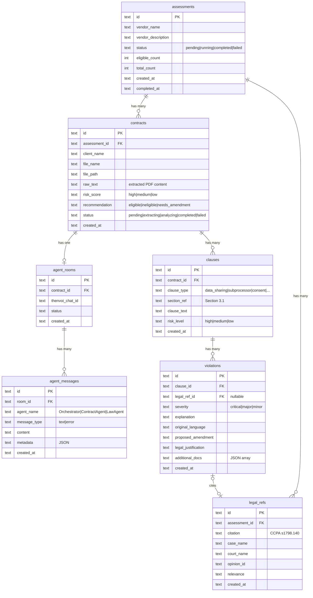

---

## User Flow

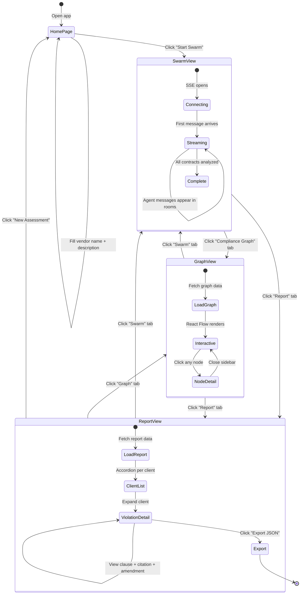

---

## Assessment Status Flow

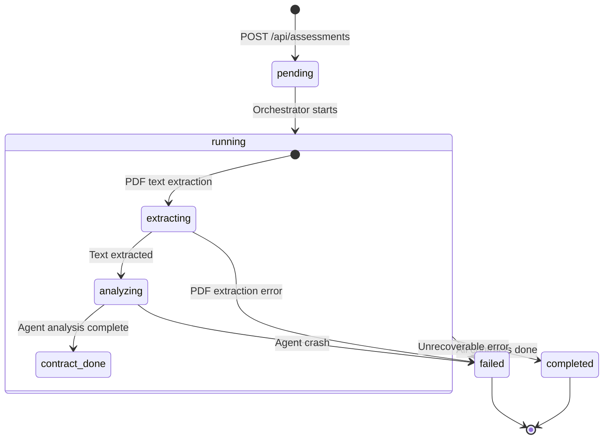

---

## Tech Stack

| Layer | Technology |
|-------|-----------|
| Frontend | Next.js 16 App Router, React 19, TypeScript |
| Styling | Tailwind CSS 4, shadcn/ui (Base UI), Framer Motion |
| Graph | React Flow (`@xyflow/react`) |
| Data Fetching | TanStack React Query, custom SSE hook |
| Backend API | Next.js Route Handlers |
| Agent Backend | Python 3.11+, FastAPI, Uvicorn |
| Agent SDK | Claude Agent SDK (`claude-agent-sdk`) |
| Legal Research | Midpage API (US case law search) |
| PDF Parsing | pdfplumber |
| Database | SQLite 3 (WAL mode), Drizzle ORM + aiosqlite |
| Fonts | Playfair Display, DM Sans, JetBrains Mono |

---

## Getting Started

### Prerequisites

- Node.js 20+
- Python 3.11+
- pnpm
- Claude Code CLI: `npm install -g @anthropic-ai/claude-code`

### Setup

```bash
# Clone
git clone git@github.com:NaichuanZhang/ContractSwarm.git
cd ContractSwarm

# Initialize database
sqlite3 contract-swarm.db < scripts/setup-db.sql

# Generate sample contracts (optional)
python scripts/generate-sample-contracts.py

# Frontend
cd web
pnpm install
pnpm dev

# Agent backend (separate terminal)
cd agents
python -m venv .venv && source .venv/bin/activate
pip install fastapi uvicorn aiosqlite pdfplumber python-dotenv pydantic httpx claude-agent-sdk

# Configure API keys
cat > .env << 'EOF'
ANTHROPIC_API_KEY=sk-ant-...
MIDPAGE_API_KEY=ak_...
EOF

uvicorn server:app --host 0.0.0.0 --port 8000
```

### Usage

1. Place client contract PDFs in the `contracts/` directory
2. Open http://localhost:3000
3. Enter the vendor name and description
4. Click **Start Swarm** — watch agents work in real-time
5. Navigate to **Compliance Graph** for visual analysis
6. Navigate to **Report** for per-client violations and amendments
7. Click **Export** to download the full JSON report

---

## API Reference

### Next.js Routes

| Method | Path | Description |
|--------|------|-------------|
| `GET` | `/api/contracts` | List PDF files from `contracts/` directory |
| `POST` | `/api/assessments` | Create assessment + trigger agent swarm |
| `GET` | `/api/assessments` | List all assessments |
| `GET` | `/api/assessments/[id]` | Assessment status + contract summaries |
| `GET` | `/api/assessments/[id]/rooms` | Agent rooms with contract mapping |
| `GET` | `/api/assessments/[id]/stream` | SSE stream of agent messages |
| `GET` | `/api/assessments/[id]/graph` | Graph nodes and edges for React Flow |
| `GET` | `/api/assessments/[id]/report` | Full nested report data |
| `GET` | `/api/assessments/[id]/export` | Downloadable JSON report |

### Python Backend

| Method | Path | Description |
|--------|------|-------------|
| `GET` | `/health` | Health check |
| `POST` | `/orchestrate` | Trigger swarm analysis (background thread) |

---

## Project Structure

```
contract-swarm/
├── contracts/                    # Client contract PDFs
├── agents/                       # Python agent backend
│   ├── server.py                 # FastAPI + threading orchestration
│   ├── orchestrator.py           # Parallel agent coordination
│   ├── prompts.py                # ContractAgent + LawAgent prompts
│   ├── result_parser.py          # Agent JSON → DB rows
│   ├── pdf_extractor.py          # PDF → text
│   ├── models.py                 # Pydantic models
│   └── db.py                     # SQLite connection
├── web/                          # Next.js 16 frontend
│   └── src/
│       ├── app/                  # Pages + API routes
│       ├── components/           # UI components
│       ├── hooks/                # useEventSource, useAssessment
│       └── lib/                  # db, schema, queries, types
├── scripts/
│   ├── setup-db.sql              # SQLite schema
│   └── generate-sample-contracts.py
└── examples/thenvoi/             # Reference implementations
```

---

## Design System

Light theme with warm gold accents.

| Token | Value | Usage |
|-------|-------|-------|
| `--background` | `#FAFAF8` | Page background |
| `--card` | `#FFFFFF` | Card surfaces |
| `--surface` | `#F0EDE8` | Elevated surfaces |
| `--border` | `#E5E0DB` | Borders and dividers |
| `--foreground` | `#1A1A1A` | Primary text |
| `--gold` | `#8B6F47` | Primary accent |
| `--risk-high` | `#DC3A2A` | High risk / critical |
| `--risk-medium` | `#B8922E` | Medium risk / major |
| `--risk-low` | `#2D7A4A` | Low risk / compliant |

---

## License

Built for the Law + LLM Hackathon.
