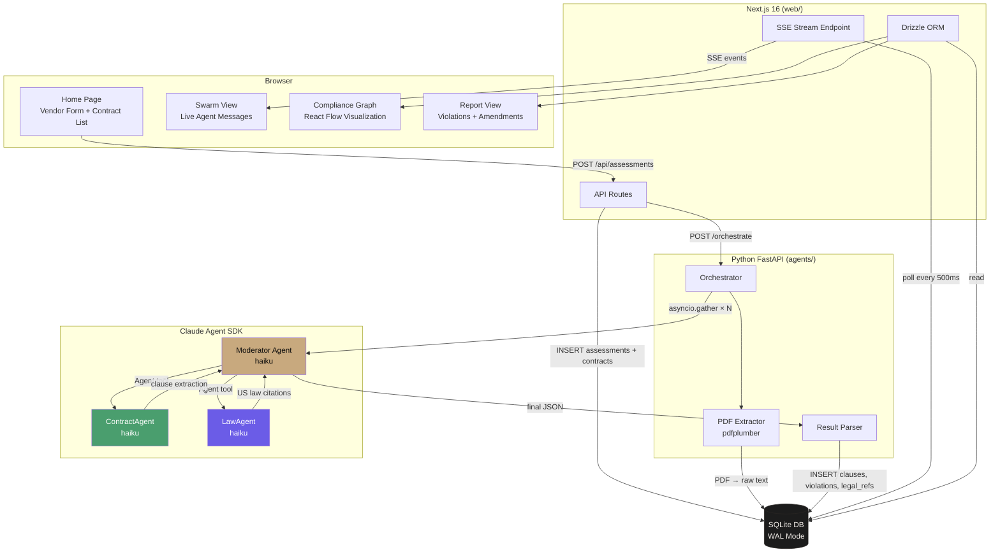
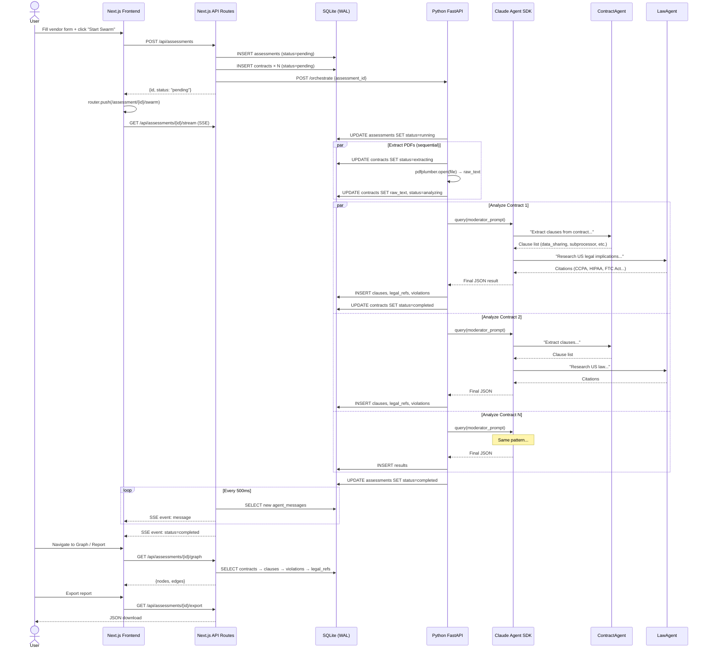
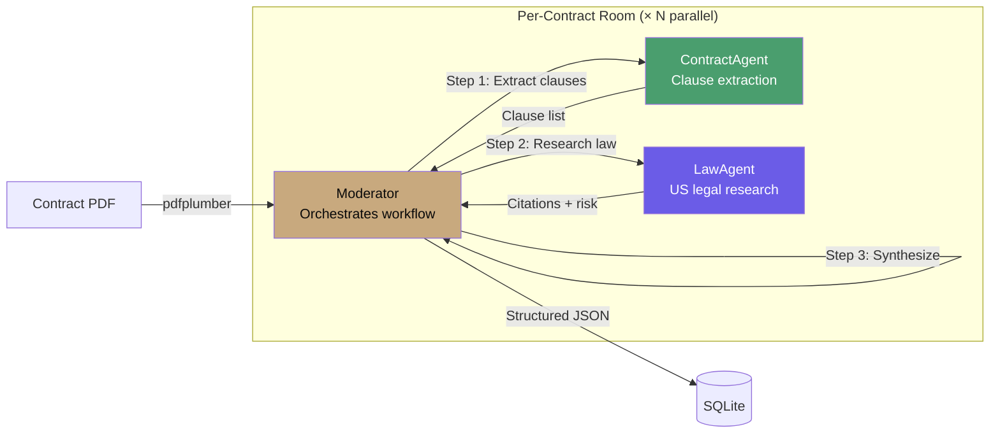
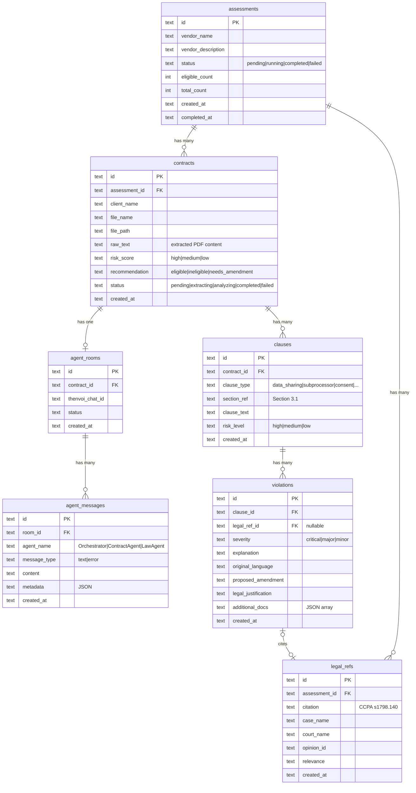
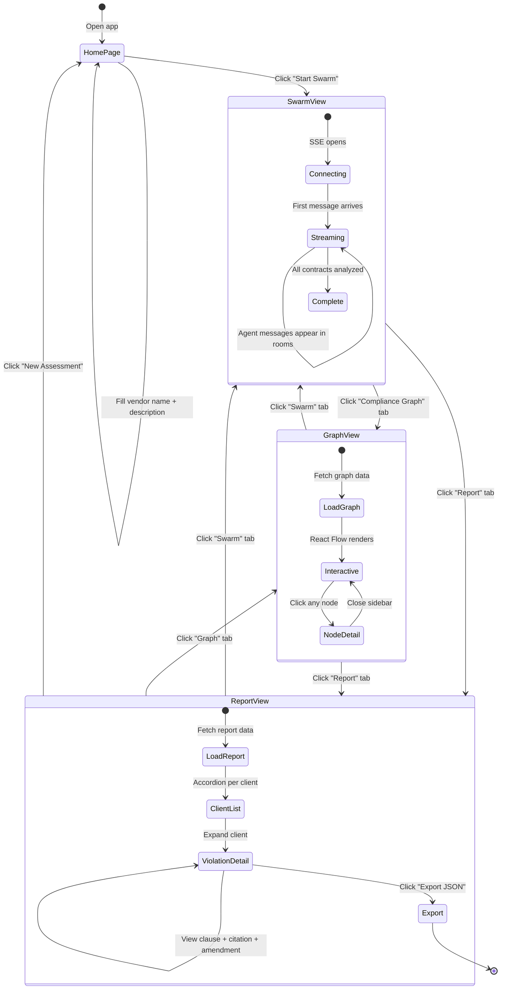
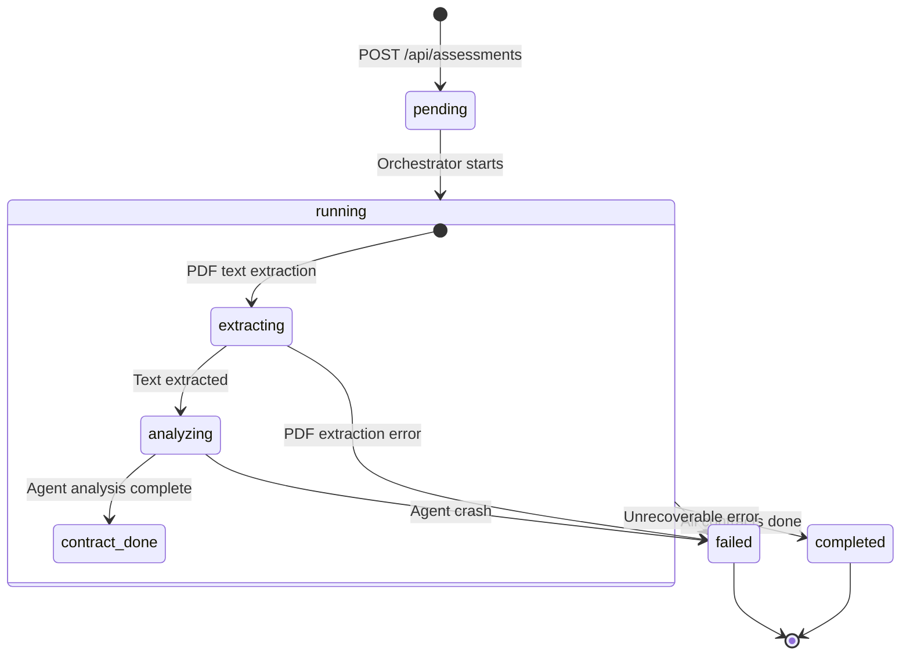

# ContractSwarm

**AI agents swarm your contracts so you don't have to.**

ContractSwarm is an AI-powered compliance tool that helps in-house lawyers assess whether they can legally onboard a new third-party vendor that will process their clients' data. It deploys a swarm of Claude AI agents to analyze every client contract in parallel — surfacing risks, violations, and draft amendments in minutes instead of weeks.


---

## How It Works

1. **Upload contracts** — Point to a directory of client contract PDFs
2. **Describe the vendor** — What does the vendor do? What data will it access? Where does it operate?
3. **Launch the swarm** — One agent team per contract, all analyzing in parallel
4. **Get results** — Per-client risk scores, violation reports, and ready-to-review contract amendments

---

## Architecture Overview



---

## Data Flow



---

## Agent Swarm Architecture



Each contract gets its own independent agent team. All teams run in parallel via `asyncio.gather()`. The Moderator invokes ContractAgent and LawAgent as subagents using Claude Agent SDK's `Agent` tool. All agents run on `claude-haiku-4-5`.

**ContractAgent** identifies restrictive clauses:
- Data sharing / subprocessor restrictions
- Consent requirements
- Data residency constraints
- Exclusivity / non-compete
- Confidentiality / liability / IP rights

**LawAgent** researches US law implications:
- Federal regulations (CCPA/CPRA, HIPAA, GLBA, FTC Act §5)
- State privacy laws (Virginia CDPA, Colorado Privacy Act, etc.)
- Case law precedents via Midpage API
- UCC and Restatement of Contracts

---

## Database Schema



---

## User Flow



---

## Assessment Status Flow



---

## Tech Stack

| Layer | Technology |
|-------|-----------|
| Frontend | Next.js 16 App Router, React 19, TypeScript |
| Styling | Tailwind CSS 4, shadcn/ui (Base UI), Framer Motion |
| Graph | React Flow (`@xyflow/react`) |
| Data Fetching | TanStack React Query, custom SSE hook |
| Backend API | Next.js Route Handlers |
| Agent Backend | Python 3.11+, FastAPI, Uvicorn |
| Agent SDK | Claude Agent SDK (`claude-agent-sdk`) |
| Legal Research | Midpage API (US case law search) |
| PDF Parsing | pdfplumber |
| Database | SQLite 3 (WAL mode), Drizzle ORM + aiosqlite |
| Fonts | Playfair Display, DM Sans, JetBrains Mono |

---

## Getting Started

### Prerequisites

- Node.js 20+
- Python 3.11+
- pnpm
- Claude Code CLI: `npm install -g @anthropic-ai/claude-code`

### Setup

```bash
# Clone
git clone git@github.com:NaichuanZhang/ContractSwarm.git
cd ContractSwarm

# Initialize database
sqlite3 contract-swarm.db < scripts/setup-db.sql

# Generate sample contracts (optional)
python scripts/generate-sample-contracts.py

# Frontend
cd web
pnpm install
pnpm dev

# Agent backend (separate terminal)
cd agents
python -m venv .venv && source .venv/bin/activate
pip install fastapi uvicorn aiosqlite pdfplumber python-dotenv pydantic httpx claude-agent-sdk

# Configure API keys
cat > .env << 'EOF'
ANTHROPIC_API_KEY=sk-ant-...
MIDPAGE_API_KEY=ak_...
EOF

uvicorn server:app --host 0.0.0.0 --port 8000
```

### Usage

1. Place client contract PDFs in the `contracts/` directory
2. Open http://localhost:3000
3. Enter the vendor name and description
4. Click **Start Swarm** — watch agents work in real-time
5. Navigate to **Compliance Graph** for visual analysis
6. Navigate to **Report** for per-client violations and amendments
7. Click **Export** to download the full JSON report

---

## API Reference

### Next.js Routes

| Method | Path | Description |
|--------|------|-------------|
| `GET` | `/api/contracts` | List PDF files from `contracts/` directory |
| `POST` | `/api/assessments` | Create assessment + trigger agent swarm |
| `GET` | `/api/assessments` | List all assessments |
| `GET` | `/api/assessments/[id]` | Assessment status + contract summaries |
| `GET` | `/api/assessments/[id]/rooms` | Agent rooms with contract mapping |
| `GET` | `/api/assessments/[id]/stream` | SSE stream of agent messages |
| `GET` | `/api/assessments/[id]/graph` | Graph nodes and edges for React Flow |
| `GET` | `/api/assessments/[id]/report` | Full nested report data |
| `GET` | `/api/assessments/[id]/export` | Downloadable JSON report |

### Python Backend

| Method | Path | Description |
|--------|------|-------------|
| `GET` | `/health` | Health check |
| `POST` | `/orchestrate` | Trigger swarm analysis (background thread) |

---

## Project Structure

```
contract-swarm/
├── contracts/                    # Client contract PDFs
├── agents/                       # Python agent backend
│   ├── server.py                 # FastAPI + threading orchestration
│   ├── orchestrator.py           # Parallel agent coordination
│   ├── prompts.py                # ContractAgent + LawAgent prompts
│   ├── result_parser.py          # Agent JSON → DB rows
│   ├── pdf_extractor.py          # PDF → text
│   ├── models.py                 # Pydantic models
│   └── db.py                     # SQLite connection
├── web/                          # Next.js 16 frontend
│   └── src/
│       ├── app/                  # Pages + API routes
│       ├── components/           # UI components
│       ├── hooks/                # useEventSource, useAssessment
│       └── lib/                  # db, schema, queries, types
├── scripts/
│   ├── setup-db.sql              # SQLite schema
│   └── generate-sample-contracts.py
└── examples/thenvoi/             # Reference implementations
```

---

## Design System

Dark-only theme with warm gold accents.

| Token | Value | Usage |
|-------|-------|-------|
| `--background` | `#0A0A0A` | Page background |
| `--card` | `#141414` | Card surfaces |
| `--surface` | `#1C1C1C` | Elevated surfaces |
| `--border` | `#2A2724` | Borders and dividers |
| `--foreground` | `#F5F0EB` | Primary text |
| `--gold` | `#C8A97E` | Primary accent |
| `--risk-high` | `#E85D4A` | High risk / critical |
| `--risk-medium` | `#D4A843` | Medium risk / major |
| `--risk-low` | `#4A9E6E` | Low risk / compliant |

---

## License

Built for the Law + LLM Hackathon.
